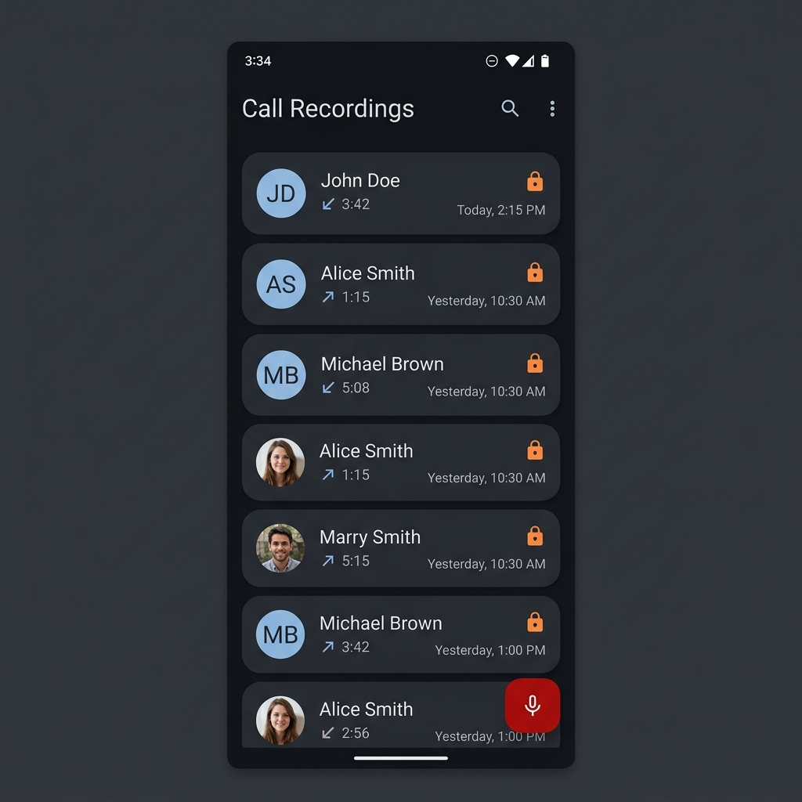
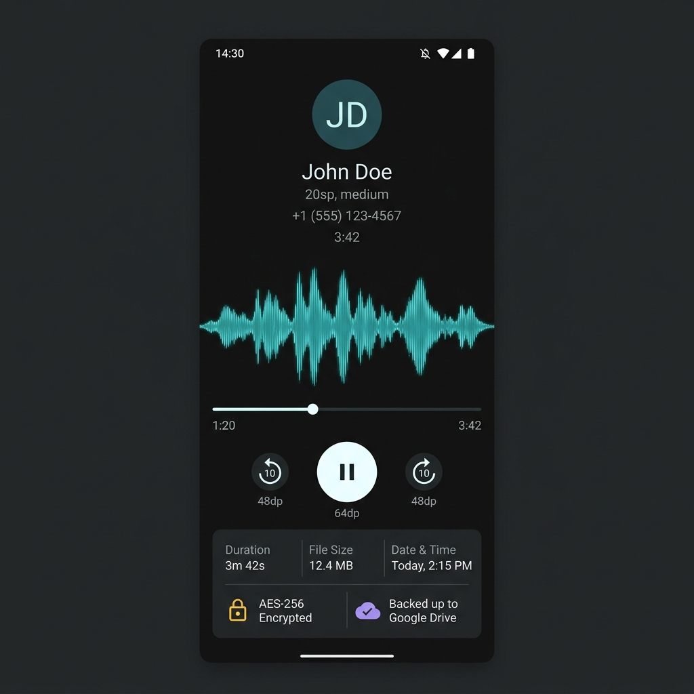
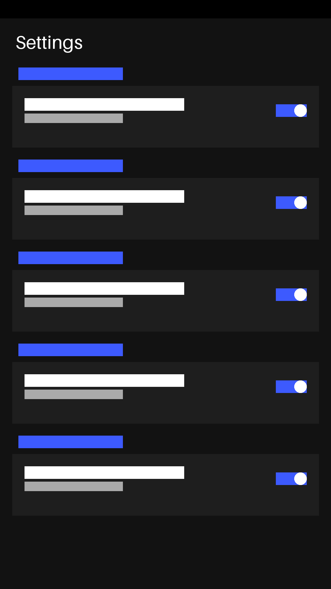
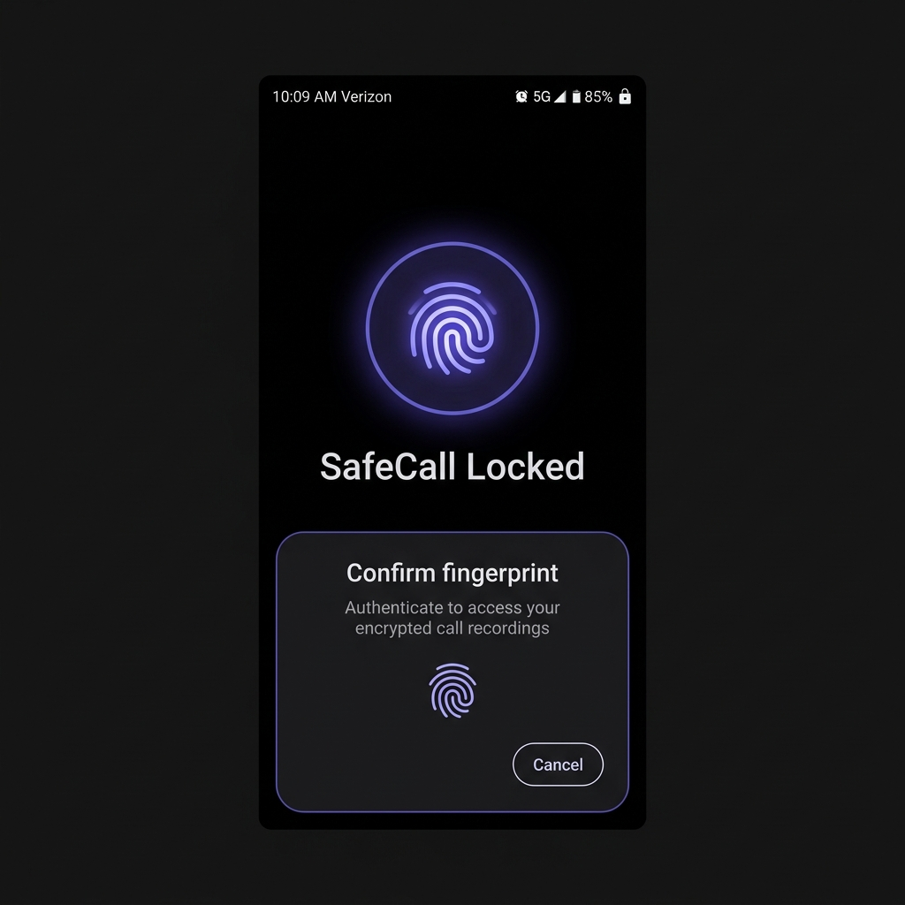
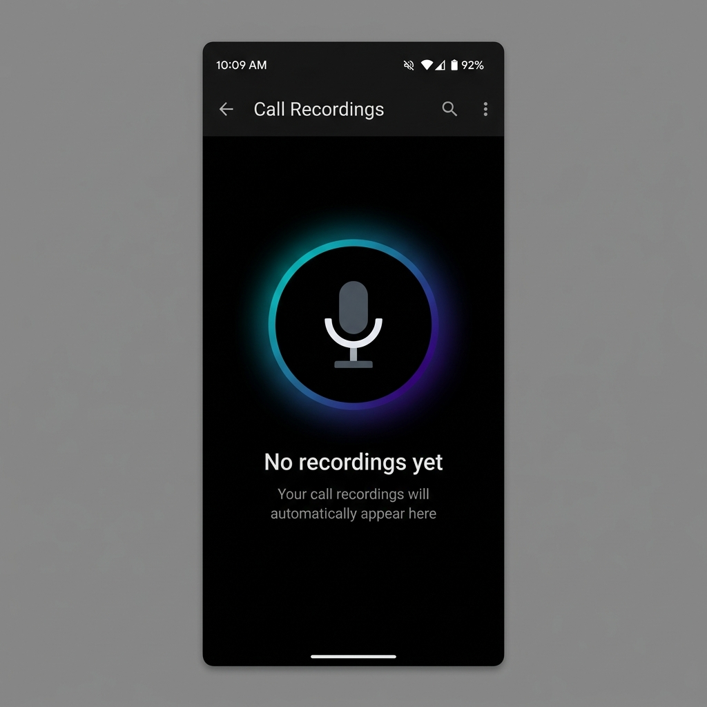

# SafeCall Recorder


A production-ready Android app (Java) for legal and transparent phone call recording with encrypted local storage and Google Drive backup.

## Features

- **Automatic Call Recording**: Records incoming and outgoing phone calls automatically
- **Encrypted Storage**: AES-256 encryption using Android Keystore
- **Google Drive Backup**: Manual and scheduled backup with Wi-Fi only option
- **Favorites & Notes**: Star important recordings and add text notes
- **App Lock**: Secure access with Biometric Authentication (Fingerprint/Face)
- **Contact Resolution**: Displays contact names for recorded calls
- **Search & Filter**: Find recordings by contact name or phone number
- **Playback Controls**: Built-in audio player with seek functionality
- **Share & Export**: Share recordings via any app

## Screenshots

| Recordings List | Recording Details | Settings | App Lock | Empty State |
|:---------------:|:-----------------:|:--------:|:--------:|:-----------:|
|  |  |  |  |  |

### Screen Descriptions

**📱 Recordings List (Home)**
- Clean card-based list of all recorded calls
- Incoming calls shown with green arrow, outgoing with blue
- Lock icon indicates encrypted, cloud icon indicates backed up
- Swipe to delete, tap to open details

**🎵 Recording Details**  
- Large playback controls with seek bar
- Play/pause with progress tracking
- Metadata display: duration, timestamp, file size
- Actions: rename, share, delete

**⚙️ Settings**
- Auto-recording toggle
- Google Drive sign-in and backup controls
- Scheduled backup with Wi-Fi-only option
- Storage statistics and clear data option

**🔐 App Lock**
- Secure biometric authentication screen
- Prompts user to authenticate to access recordings

**📭 Empty State**
- Friendly illustration when no recordings are found
- Encourages user to make their first call

> **Note**: To add screenshots, build the app in Android Studio, run on a device, and capture screenshots to `screenshots/` folder.

## Requirements

- Android 8.0 (API 26) or higher
- Android Studio Hedgehog (2023.1.1) or newer
- JDK 17

## Project Structure

```
app/src/main/java/com/safecall/recorder/
├── SafeCallApp.java              # Application class with Hilt
├── MainActivity.java             # Main recordings list
├── RecordingDetailsActivity.java # Recording playback
├── SettingsActivity.java         # App settings
├── data/
│   ├── local/
│   │   ├── db/                   # Room database
│   │   │   ├── AppDatabase.java
│   │   │   ├── RecordingDao.java
│   │   │   └── RecordingEntity.java
│   │   └── prefs/
│   │       └── PreferencesManager.java
│   ├── repository/
│   │   └── RecordingRepository.java
│   └── encryption/
│       └── EncryptionManager.java
├── service/
│   ├── CallRecorderService.java  # Foreground service for recording
│   ├── PhoneCallReceiver.java    # BroadcastReceiver for call detection
│   └── BootReceiver.java         # Boot completed receiver
├── backup/
│   ├── GoogleSignInHelper.java   # Google Sign-In integration
│   ├── DriveBackupManager.java   # Google Drive API operations
│   └── BackupWorker.java         # WorkManager scheduled backups
├── ui/
│   └── RecordingsAdapter.java    # RecyclerView adapter
└── di/
    └── AppModule.java            # Hilt dependency injection
```

## Setup Instructions

### 1. Open in Android Studio

Open the project in Android Studio:
- File → Open → Navigate to `/home/samarpit/Documents/Projects/2026/recorder`
- Wait for Gradle sync to complete

### 2. Configure Google Drive API (Optional)

To enable Google Drive backup:

1. Go to [Google Cloud Console](https://console.cloud.google.com/)
2. Create a new project or select an existing one
3. Enable the **Google Drive API**
4. Create OAuth 2.0 credentials:
   - Application type: Android
   - Package name: `com.safecall.recorder`
   - SHA-1 fingerprint: Use `./gradlew signingReport`
5. Download `google-services.json` (if using Firebase) or note the client ID

### 3. Build the App

In Android Studio:
- Build → Make Project (Ctrl+F9)
- Run → Run 'app' (Shift+F10)

Or via command line (requires Gradle installation):
```bash
./gradlew assembleDebug
```

### 4. Install on Device

Connect an Android device via USB and run from Android Studio, or:
```bash
adb install app/build/outputs/apk/debug/app-debug.apk
```

## Permissions Required

| Permission | Purpose |
|------------|---------|
| `READ_PHONE_STATE` | Detect incoming/outgoing calls |
| `RECORD_AUDIO` | Record audio during calls |
| `READ_CONTACTS` | Display contact names |
| `READ_CALL_LOG` | Get call details |
| `FOREGROUND_SERVICE` | Run recording in background |
| `INTERNET` | Google Drive backup |

## Important Notes

### Call Recording Limitations

Due to Android restrictions (especially Android 10+):

- **VOICE_CALL audio source** may not work on all devices/OEMs
- The app automatically falls back to microphone-only recording
- Some manufacturers block call recording entirely

### Legal Disclaimer

⚠️ **Important**: Call recording laws vary by jurisdiction. This app implements user consent UI, but users are responsible for complying with local laws (one-party vs two-party consent states/countries).

## Testing

### On Physical Device

Call recording can only be tested on a physical device (not emulator):

1. Install the app
2. Complete onboarding and grant permissions
3. Make a test phone call
4. After the call ends, the recording should appear in the list

## Tech Stack

- **Language**: Java
- **Architecture**: MVVM with Repository pattern
- **DI**: Hilt (Dagger)
- **Database**: Room
- **Encryption**: AES-256-GCM via Android Keystore
- **UI**: Material 3 with ViewBinding
- **Background Work**: WorkManager
- **Cloud**: Google Drive API

## License

MIT License - See LICENSE file for details.
